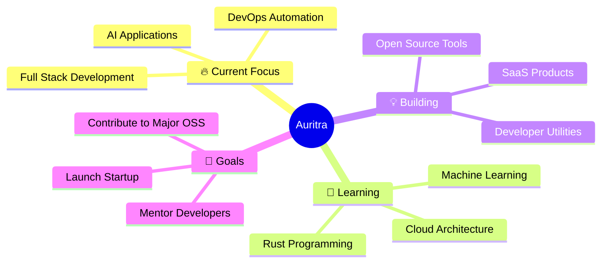

# 👋 Welcome to My Digital Universe

<div align="center">
  
</div>

<div align="center">
  
  
  
</div>

## About Me

<div align="center">
<table>
<tr>
<td>

**🎯 Current Focus**
```diff
+ Developing AI-powered applications
+ Enhancing Full-Stack Development with modern frameworks
+ Designing Cloud & MLOps pipelines for scalable AI deployment
+ Applying Data Science & Analytics for real-world insights
+ Exploring Responsible & Ethical AI
```

</td>
<td>

**💻 Languages**
```yaml
Primary:   Python,                   Java
           (AI/ML, Data Science)     (Backend, OOP)
Exploring: Go,                       Rust
           (Cloud & Microservices)   (High-performance systems)
Learning:  C++
           (AI frameworks, performance optimization)

```

</td>
<td>

**🛠️ Technologies**
```json
{
  "frontend": ["React", "Next.js"],
  "backend": ["Node.js", "FastAPI", "Express"],
  "cloud": ["AWS", "Docker", "Kubernetes"],
  "databases": ["PostgreSQL", "MongoDB", "Supabase"],
  "ai_ml": ["Python", "PyTorch", "TensorFlow", "Scikit-learn", "Hugging Face Transformers"],
  "data": ["Pandas", "NumPy", "Matplotlib", "Seaborn"],
  "tools": ["Git", "Linux", "Jupyter", "VS Code"]
}
```

</td>
</tr>
</table>
</div>

<div align="center">

### 💡 Fun Facts About Me

🔥 I debug code in my dreams • ⚡ Coffee-driven developer • 🚀 Open source enthusiast

</div>

<div align="center">

## 📊 GitHub Analytics


</div>

<div align="center">

## 🔥 Contribution Stats


</div>

<div align="center">

## 🏆 GitHub Trophies


</div>

## 💻 Tech Stack

<div align="center">

### Languages


### Frontend


### Backend


### Cloud & DevOps


### Databases


### AI & ML


### Data Science


### Tools


</div>

## 📈 Contribution Graph

<div align="center">
  
</div>

## 🎯 Featured Projects
<div align="center">
  <table cellpadding="0" cellspacing="15" border="0">
    <tr>
      <td align="center">
        <a href="https://github.com/auri-ap-cn/portfolio">
          
        </a>
        <br><br>
        <div align="center"><sub><i>Personal portfolio website showcasing projects, skills, and professional experience</i></sub></div>
      </td>
      <td align="center">
        <a href="https://github.com/auri-ap-cn/DevOps-Toolkit">
          
        </a>
        <br><br>
        <div align="center"><sub><i>Comprehensive collection of DevOps tools and automation scripts for streamlined development workflows</i></sub></div>
      </td>
    </tr>
  </table>
</div>

## 🌟 What I'm Up To



## Contributions
<div align="center">

</div>

## 
<div align="center">
  
</div>

## 📚 Latest Blog Posts

<!-- BLOG-POST-LIST:START -->
- 🔥 Building Scalable APIs with Go and PostgreSQL
- ⚡ Advanced React Patterns Every Developer Should Know
- 🚀 Deploying Full-Stack Apps with Docker and AWS
- 🎯 TypeScript Best Practices for Large Applications
<!-- BLOG-POST-LIST:END -->

## 🤝 Let's Connect & Collaborate

<div align="center">

[](https://auritrapaul.dev)
[](https://linkedin.com/in/auritra-paul-shaumik)
[](https://twitter.com/auri_ap_cn)
[](mailto:auritra.dev@gmail.com)

</div>

## 💖 Support My Work

<div align="center">

[](https://buymeacoffee.com/auritra)
[](https://paypal.me/auritrapaul)

</div>

---

<div align="center">
  
</div>

<div align="center">
  <sub>Built with ❤️ by <strong>Auritra Paul Shaumik</strong> • Crafted with passion and attention to detail • Open to collaborations and new challenges</sub>
</div>
