# 👋 Welcome to My Digital Universe

<div align="center">
  
</div>

<div align="center">
  
  
  
</div>

## 🚀 About Me

<div align="center">
<table>
<tr>
<td>

**🎯 Current Focus**
```diff
+ Building AI-powered applications
+ Full Stack Development
+ DevOps & Cloud Architecture
```

</td>
<td>

**💻 Languages**
```yaml
Primary: TypeScript, Python, JavaScript
Exploring: Go, Rust
Learning: WebAssembly
```

</td>
<td>

**🛠️ Technologies**
```json
{
  "frontend": ["React", "Next.js", "Vue.js"],
  "backend": ["Node.js", "FastAPI", "Express"],
  "cloud": ["AWS", "Docker", "K8s"],
  "databases": ["PostgreSQL", "MongoDB"]
}
```

</td>
</tr>
</table>
</div>

<div align="center">

### 💡 Fun Facts About Me

🔥 I debug code in my dreams • ⚡ Coffee-driven developer • 🚀 Open source enthusiast • 🎮 Gaming in spare time

</div>

<div align="center">

## 📊 GitHub Analytics


</div>

<div align="center">

## 🔥 Contribution Stats


</div>

<div align="center">

## 🏆 GitHub Trophies


</div>

## 💻 Tech Stack

<div align="center">

### Languages


### Frontend


### Backend & Cloud


### Databases


</div>

## 📈 Contribution Graph

<div align="center">
  
</div>

## 🎯 Featured Projects

<div align="center">

### 🚧 Coming Soon!
I'm working on some amazing projects. Check back soon to see them here!

**🔄 Current Projects in Development:**
- 🔧 DevOps Toolkit - Automated CI/CD pipelines
- 🤖 AI Playground - Machine Learning experiments  
- 🌐 Portfolio Website - Modern responsive design
- ⚡ Quick Tools - Developer utilities

</div>

## 🌟 What I'm Up To

```mermaid
mindmap
  root((Auritra))
    🔥 Current Focus
      AI Applications
      Full Stack Development
      DevOps Automation
    🚀 Learning
      Rust Programming
      Machine Learning
      Cloud Architecture
    💡 Building
      Open Source Tools
      SaaS Products
      Developer Utilities
    🎯 Goals
      Contribute to Major OSS
      Launch Startup
      Mentor Developers
```



## Contributions
<div align="center">

</div>

## <div align="center">
  
</div>

## 📚 Latest Blog Posts

<!-- BLOG-POST-LIST:START -->
- 🔥 Building Scalable APIs with Go and PostgreSQL
- ⚡ Advanced React Patterns Every Developer Should Know
- 🚀 Deploying Full-Stack Apps with Docker and AWS
- 🎯 TypeScript Best Practices for Large Applications
<!-- BLOG-POST-LIST:END -->

## 🤝 Let's Connect & Collaborate

<div align="center">

[](https://auritrapaul.dev)
[](https://linkedin.com/in/auritra-paul-shaumik)
[](https://twitter.com/auri_ap_cn)
[](mailto:auritra.dev@gmail.com)

</div>

## 💖 Support My Work

<div align="center">

[](https://buymeacoffee.com/auritra)
[](https://paypal.me/auritrapaul)

</div>

---

<div align="center">
  
</div>

<div align="center">
  <sub>Built with ❤️ by <strong>Auritra Paul Shaumik</strong> • Crafted with passion and attention to detail • Open to collaborations and new challenges</sub>
</div>
